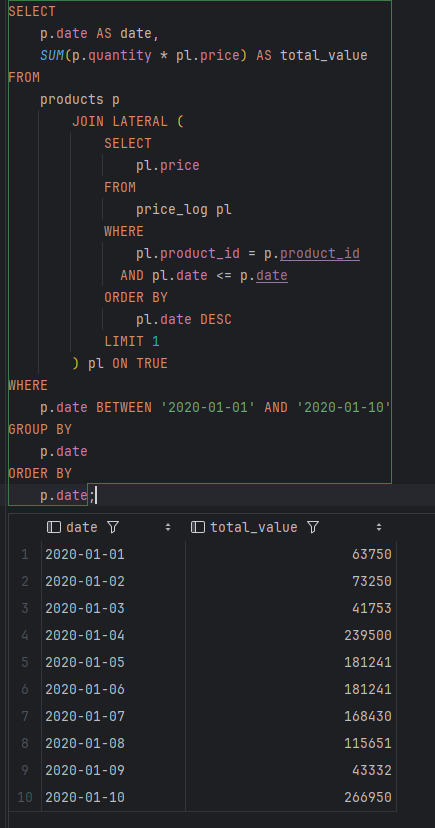

# Тестовое задание Underhood

Тестовое задание состоит из 2 частей.

## Задание № 1.

Написать SQL запрос, который выведет за каждый день с 2020-01-01 по 2020-01-10 стоимость всех товаров на складе (таблица products).
Например, за 2020-01-01 для товара (1) получается 500*30 + для товара (2) 3000*10 + для товара (3) 25*750 = 63750, а за 2020-01-03 - 311*33 + 970*17 + 20*750 = 41753.

Немного переписал скрипт наполнения тестовыми данными (файл [preconditions.sql](preconditions.sql)):
```sql
CREATE TABLE products (
                          id SERIAL,
                          date DATE,
                          product_id INT NOT NULL,
                          quantity INT NOT NULL,
                          PRIMARY KEY (id)
);

INSERT INTO products
(
    date,
    product_id,
    quantity
)
VALUES
    ('2020-01-01',1,500),
    ('2020-01-01',2,3000),
    ('2020-01-01',3,25),
    ('2020-01-02',1,450),
    ('2020-01-02',2,2500),
    ('2020-01-02',3,23),
    ('2020-01-03',1,311),
    ('2020-01-03',2,970),
    ('2020-01-03',3,20),
    ('2020-01-04',1,1000),
    ('2020-01-04',2,10000),
    ('2020-01-04',3,50),
    ('2020-01-05',1,632),
    ('2020-01-05',2,7868),
    ('2020-01-05',3,39),
    ('2020-01-06',1,632),
    ('2020-01-06',2,7868),
    ('2020-01-06',3,39),
    ('2020-01-07',1,737),
    ('2020-01-07',2,6999),
    ('2020-01-07',3,37),
    ('2020-01-08',1,590),
    ('2020-01-08',2,4500),
    ('2020-01-08',3,29),
    ('2020-01-09',1,311),
    ('2020-01-09',2,970),
    ('2020-01-09',3,20),
    ('2020-01-10',1,1000),
    ('2020-01-10',2,10000),
    ('2020-01-10',3,50);

CREATE TABLE price_log (
                           id SERIAL,
                           date DATE,
                           product_id INT NOT NULL,
                           price INT NOT NULL,
                           PRIMARY KEY (id)
);

INSERT INTO price_log
(
    date,
    product_id,
    price
)
VALUES
    ('2019-12-29',1,30),
    ('2019-11-01',2,10),
    ('2019-01-01',3,750),
    ('2020-01-03',1,33),
    ('2020-01-04',1,32),
    ('2020-01-02',2,17),
    ('2020-01-09',2,20),
    ('2020-01-05',3,699);
```

Решение (файл [answer.sql](answer.sql)):



## Задание № 2.

### Условие

Необходимо написать на php скрипт, который получит результат поиска с [этой страницы](https://search.ipaustralia.gov.au/trademarks/search/advanced).

Необходимо, чтобы скрипт, который мы можем вызвать из консоли с передачей параметра для поиска, запускал поиск по полю «word» например со значением: abc.

Получал результат поиска, проходил по всем страницам, сохранял данные и выводил результат.

### Реализация

Был реализован функционал поиска данных по слову с последующим выводом в консоль.
Дополнительно внедрен функционал записи полученных данных в файл и заложен интерфейс под реализацию хранения в relational-DB (e.g. PostgreSQL).

- [x] Запрос на сервис IP Australia для поиска по слову.
- [x] Форматирование результатов запроса.
- [x] Вывод результата в консоль.
- [x] Запись результата в файлы.
- [ ] Подключение конфигурации проекта.
- [ ] Подключение PostgreSQL и реализация записи данных в БД.

### Переменные окружения

В файле `.env` необходимо указать переменные `DB_HOST`, `DB_PORT`, `DB_USER`, `DB_PASSWORD` и `DB_NAME`.

### Развертывание

Этот проект может использовать Composer для развертывания пакета или Docker для развертывания PHP 7.4 сервера и базы данных PostgreSQL 14. 
Также можно просто клонировать проект локально и поместить уже на машину с PHP 7.4.

### Шаги для развертывания через Composer


Этот проект не был опубликован в Packagist, поэтому, чтобы добавить его как пакет, нужно добавить в composer.json:

```json
{
    "repositories": [
        {
            "type": "vcs",
            "url": "https://github.com/deadbyback/underhood_test"
        }
    ],
    "require": {
        "deadbyback/underhood_test": "dev-main"
    }
}

```

Или командой
`composer require deadbyback/underhood_test:@dev-main --prefer-source`
Убедитесь, что в корне пакета существует файл `.env` и добавьте в него следующие строки, заменив значения на свои:

```plaintext
DB_HOST=localhost
DB_PORT=5432
DB_USER=postgres
DB_PASSWORD=postgres
DB_NAME=your_db_name
```
Чтобы запустить приложение, необходимо:
```sh
php app.php <keyword>
```

### Шаги для развертывания через Docker

1. Убедитесь, что Docker и Docker Compose установлены на вашем компьютере.
2. Клонируйте репозиторий с проектом:
```sh
git clone https://github.com/deadbyback/underhood_test
cd underhood_test
```
3. Убедитесь, что в корне проекта существует файл `.env` и добавьте в него следующие строки, заменив значения на свои:
```plaintext
DB_HOST=localhost
DB_PORT=5432
DB_USER=postgres
DB_PASSWORD=postgres
DB_NAME=your_db_name
```
4. Перейдите в папку `docker` и создайте и запустите контейнеры:
```sh
docker-compose up --build
```
5. Чтобы запустить приложение, необходимо вызвать консоль из контейнера:
```sh
docker compose exec trademark_scrapper php app.php <keyword>
```